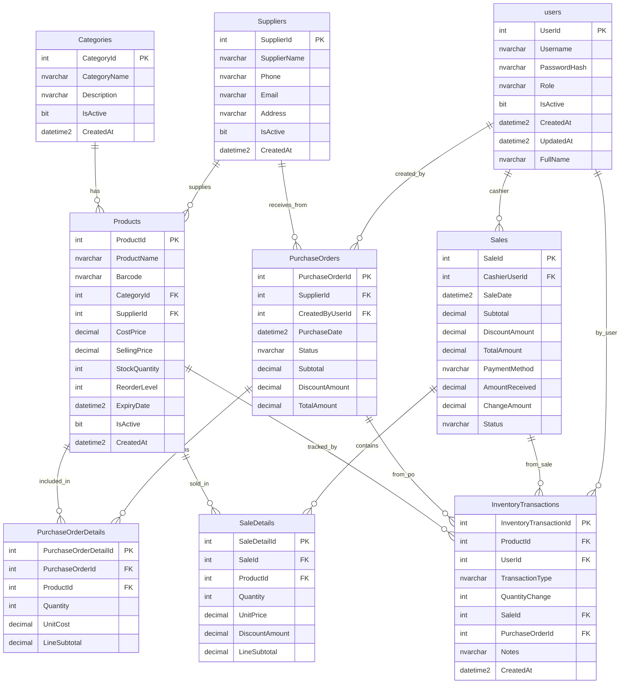

# Mart Management System (Mini-Mart POS)

[](https://dotnet.microsoft.com/)
[](https://learn.microsoft.com/en-us/dotnet/desktop/winforms/)
[](https://learn.microsoft.com/en-us/sql/)
[]()

## Table of Contents

- [1. Project Description and Course Context](#1-project-description-and-course-context)
- [2. Team](#2-team)
- [3. Key Features](#3-key-features)
- [4. Technology Stack](#4-technology-stack)
- [5. Architecture](#5-architecture)
- [6. OOP Design](#6-oop-design)
- [7. Project Structure](#7-project-structure)
- [8. Database Schema](#8-database-schema)
- [9. Getting Started](#9-getting-started)
- [10. Usage Guide](#10-usage-guide)
- [11. Screenshots](#11-screenshots)
- [12. Known Limitations](#12-known-limitations)
- [13. Roadmap](#13-roadmap)
- [14. Troubleshooting](#14-troubleshooting)
- [15. Contributing](#15-contributing)
- [16. License](#16-license)
- [17. ភាសាខ្មែរ (Khmer)](#ភាសាខ្មែរ-khmer)

## 1. Project Description and Course Context

The **Mart Management System** is a Windows desktop application for managing a small retail mart. It supports point-of-sale (POS), inventory tracking, purchasing, supplier management, reporting, and role-based access control (Admin and Cashier). 

This project was developed as part of the **Object-Oriented Analysis and Design (OOAD)** university course. The application is implemented in **C# .NET 8 Windows Forms** with **SQL Server** and uses **ADO.NET** for data access (no ORM). Authentication uses **BCrypt.Net-Next** for password hashing.

## 2. Team

| Name | Role |
|---|---|
| Mach Bunneng | [Fill in] |
| Phou Phoeuk | [Fill in] |
| Mao Visal | [Fill in] |
| Tol Tonglang | [Fill in] |

## 3. Key Features

- **Authentication & Registration**: Login with BCrypt password verification. Self-registration creates a Cashier account with `IsActive = false` (pending admin approval). Pending approval is only reported to users who have a valid password to avoid user enumeration.
- **Role-Based Access**: Admin and Cashier roles enforced via `MainForm` (Admins see Dashboard, Products, Categories, Suppliers, Stock Alerts, Purchases, Reports, Users, Settings; Cashiers can access Sales/POS and Sales History).
- **Dashboard** (Admin): Today’s revenue, sales count, active products, low stock count, expiring soon count, top-selling product with quantity sold, and a 7-day sales trend bar chart.
- **Products**: create, edit, keyword search (name/barcode) and activate/deactivate products holding barcode, category, supplier, cost/selling price, stock quantity, reorder level and expiry date. Create and update run inside a transaction.
- **Categories & Suppliers**: create, edit, keyword search and activate/deactivate. Rows are never hard-deleted; the row action toggles the `IsActive` flag (soft delete).
- **Sales/POS** (Cashier/Admin access as allowed): Add products to cart, adjust quantity, apply discount, cash/QR payment methods, compute totals and change; stock is decremented atomically on completed sale.
- **Sales History**: Filter by date range, cashier, payment method, status, keyword; view sale details.
- **Purchases (Purchase Orders)** (Admin): pick a supplier, add product lines with quantity/unit cost, apply a discount, save as Draft, then Receive the order - receiving flips the status to `Received` and increases stock through an `InventoryTransaction` row.
- **Stock Alerts** (Admin): Low stock, out of stock, expiring soon, expired; adjust stock via Stock Adjustment.
- **Stock Adjustment**: Manual adjustments with notes (creates inventory transaction).
- **User Management** (Admin): View/search/filter users by role, activate/deactivate users, create/edit users. Self-deactivation and last-active-admin protection enforced.
- **Reports** (Admin): Sales trend, revenue by cashier, revenue by payment method, top products, sales by category, supplier purchase history, inventory value.
- **Settings** (Admin): View account information.

## 4. Technology Stack

**Verified from `.csproj` (Mart_Management_System.csproj):**
- Target Framework: `net8.0-windows`
- Output Type: `WinExe`
- Windows Forms: `UseWindowsForms` enabled
- Nullable reference types: `enable`
- Implicit Usings: `enable`
- Packages:
  - `BCrypt.Net-Next` v4.2.0 (password hashing/verification)
  - `Microsoft.Extensions.Configuration` v8.0.0
  - `Microsoft.Extensions.Configuration.Json` v8.0.0
  - `Microsoft.Data.SqlClient` v7.1.0 (ADO.NET SQL Server)

## 5. Architecture

**Layering (verified):**
- **UI/Presentation**: Windows Forms (`Forms/`, `UI/UiTheme.cs` for theming)
- **Services**: Business logic (`Services/AuthenticationService.cs`)
- **Repositories**: Data access (`Repositories/*`, `IRepository<T>`, `IUser`)
- **Models**: Domain entities/interfaces (`Models/*`, `IUser`)
- **Data**: Connection management (`Data/DatabaseConnection.cs`), migrations/schema (`Data/Migrations/`)
- **Enums**: Type-safe constants (`Enums/*`)

**Flow:** `Forms -> Services/Repositories -> ADO.NET (SqlConnection/SqlCommand/SqlDataReader/transactions) -> SQL Server`

**ASCII Architecture Diagram:**

```text
┌─────────────────────────────────────────────────────────────────────┐
│                         Windows Forms (UI)                        │
│                        Forms/ + UI/UiTheme.cs                      │
└─────────────┬────────────────────────────┬────────────────────────┘
              │                            │
              ▼                            ▼
        ┌─────────────┐              ┌─────────────────────┐
        │   Services  │              │     Repositories    │
        │  (Auth)     │              │  IRepository<T>,    │
        │             │              │  IUser + impls      │
        └─────────────┘              └──────────┬──────────┘
                                               │
                                               ▼
                                    ┌─────────────────────┐
                                    │   Data Layer        │
                                    │ DatabaseConnection  │
                                    │  (ADO.NET via      │
                                    │  Microsoft.Data.   │
                                    │  SqlClient)        │
                                    └──────────┬──────────┘
                                               │
                                               ▼
                                        ┌─────────────────────┐
                                        │   SQL Server DB     │
                                        │  (9 tables, FKs,   │
                                        │   CHECKs, indexes) │
                                        └─────────────────────┘
```

## 6. OOP Design

Key OOP elements (verified from code):

| OOP Concept | Implementation | Notes |
|---|---|---|
| Abstract base class | `Models/AuditableEntity` | Abstract with `IsActive` (bool), `CreatedAt` (DateTime), abstract `GetDisplayName()` |
| Interface (user contract) | `Models/IUser` | `FindByUsername`, `GetById`, `GetAll`, `Search(DataTable)`, `Create`, `Update(user, passwordHash?)`, `SetActive` |
| Generic repository interface | `Repositories/IRepository<T>` | `GetAll(string? keyword=null)`, `GetById`, `Create`, `Update`, `SetActive` |
| Polymorphism/overrides | `Category : AuditableEntity` → `GetDisplayName()` returns `CategoryName`; `Product` → `ProductName`; `Supplier` → `SupplierName`; `User` → `FullName` | Verified in Models |
| Repository implementations | `UserRepository : IUser`; `CategoryRepository : IRepository<Category>`; `SupplierRepository : IRepository<Supplier>`; others implement domain-specific data access (no generic interface) | Verified |
| Services | `AuthenticationService` (sealed) encapsulates auth logic with `BCrypt.Verify` | Dependency injected via `IUser` |
| Enums | `UserRole { Admin, Cashier }`, `PaymentMethod { Cash, QRCode }`, `SaleStatus { Completed, Cancelled, Refunded }`, `PurchaseOrderStatus { Draft, Received, Cancelled }`, `InventoryTransactionType { Purchase, Sale, Return, Adjustment }`, `AuthenticationFailure { None, InvalidCredentials, PendingApproval }` | Strongly typed |

## 7. Project Structure

**Real file counts (verified):**

- Forms: **20** code-behind files (`Forms/*.cs`), **20** generated `*.Designer.cs` files, **12** `*.resx` resource files
- Repositories: 9 classes (8 implementations + `IRepository.cs`). Repo implementation count: 8.
- Services: 1 (`AuthenticationService.cs`)
- Models: 16 model classes/interfaces (`AuditableEntity`, `Category`, `DashboardSummary`, `IUser`, `InventoryTransaction`, `Product`, `PurchaseOrder`, `PurchaseOrderDetail`, `ReportRow`, `ReportTotals`, `Sale`, `SaleDetail`, `SaleHistoryFilter`, `SaleSummary`, `Supplier`, `User`)
- Enums: 6
- UI: 1 (`UiTheme.cs`)
- Data: `DatabaseConnection.cs` + `Migrations/` (2 migration files: `000_Full_Schema.sql`, `001_Create_InventoryTransactions.sql`)

**Key files:** `Program.cs` (starts `LoginForm`), `Mart_Management_System.csproj`, `appsettings.example.json`, `appsettings.json`, `appsettings.Development.json`.

## 8. Database Schema

Schema derived from **`Data/Migrations/000_Full_Schema.sql`** (working tree version). Note: `001_Create_InventoryTransactions.sql` also exists; the full schema script is the canonical definition referenced.

**Counts (verified):**
- Application tables: **9**  
  (`dbo.Categories`, `dbo.Suppliers`, `dbo.Products`, `dbo.users`, `dbo.PurchaseOrders`, `dbo.PurchaseOrderDetails`, `dbo.Sales`, `dbo.InventoryTransactions`, `dbo.SaleDetails`)
- Foreign keys: **13 FK** constraints (see FK list below)
- CHECK constraints: **22 per-column CHECK** constraints (definitions reproduced verbatim)
- Secondary indexes: **6** total - 3 unique (one of them filtered) + 3 non-unique
- Filtered unique index: `UQ_Products_Barcode` on `Products(Barcode)` **WHERE ([Barcode] IS NOT NULL)**
- **No CHECK constraint on `users.Role`** (Role is `nvarchar(20) NOT NULL` with no CK in schema)
- Real defaults and mixed time-zone defaults preserved as-is (`sysdatetime()`, `getdate()`, `sysutcdatetime()` where used)
- `dbo.sysdiagrams` is excluded (SSMS artifact)

**Tables (parents-first as emitted):**

1. `Categories` (PK `PK__Categori__19093A0BF5632614`, CategoryId IDENTITY(1,1), UQ `UQ_Categories_CategoryName`)
2. `Suppliers` (PK `PK__Supplier__4BE666B4857C5B14`, SupplierId IDENTITY(1,1))
3. `Products` (PK `PK__Products__B40CC6CDAED443D2`, ProductId IDENTITY(1,1)); CHECKs on CostPrice/ReorderLevel/SellingPrice/StockQuantity >= 0; FKs to Categories, Suppliers
4. `users` (PK `PK__users__3213E83FA7A935E8`, UserId IDENTITY(1,1), UQ `UQ_users_Username`, UpdatedAt/CreatedAt use `getdate()` defaults in schema; FullName NOT NULL DEFAULT '')
5. `PurchaseOrders` (PK `PK__Purchase__036BACA4A45BCE0F`, Status CHECK in {'Draft','Received','Cancelled'}, numeric CHECKs >=0; FKs to Suppliers, users)
6. `PurchaseOrderDetails` (PK `PK__Purchase__5026B698A34CA24E`, Quantity>0, UnitCost/LineSubtotal>=0; FKs to Products, PurchaseOrders)
7. `Sales` (PK `PK__Sales__1EE3C3FF0AFE4E0D`, PaymentMethod CHECK in {'Cash','QRCode'}, Status CHECK in {'Completed','Cancelled','Refunded'}, numeric CHECKs>=0; FK to users)
8. `InventoryTransactions` (PK `PK_InventoryTransactions`, TransactionType CHECK in {'Purchase','Sale','Return','Adjustment'}, QuantityChange<>0; FKs to Products, PurchaseOrders, Sales, users; CreatedAt default `sysutcdatetime()`; indexes: ProductId+CreatedAt, PurchaseOrderId, SaleId)
9. `SaleDetails` (PK `PK__SaleDeta__70DB14FEBDC4687B`, Quantity>0, amounts>=0; FKs to Products, Sales)

**Foreign Keys (13):**
- `FK_Products_Categories` (Products.CategoryId -> Categories.CategoryId)
- `FK_Products_Suppliers` (Products.SupplierId -> Suppliers.SupplierId)
- `FK_PurchaseOrders_Suppliers` (PurchaseOrders.SupplierId -> Suppliers.SupplierId)
- `FK_PurchaseOrders_Users` (PurchaseOrders.CreatedByUserId -> users.UserId)
- `FK_PurchaseOrderDetails_Products` (PurchaseOrderDetails.ProductId -> Products.ProductId)
- `FK_PurchaseOrderDetails_PurchaseOrders` (PurchaseOrderDetails.PurchaseOrderId -> PurchaseOrders.PurchaseOrderId)
- `FK_Sales_Users` (Sales.CashierUserId -> users.UserId)
- `FK_InventoryTransactions_Products` (InventoryTransactions.ProductId -> Products.ProductId)
- `FK_InventoryTransactions_PurchaseOrders` (InventoryTransactions.PurchaseOrderId -> PurchaseOrders.PurchaseOrderId)
- `FK_InventoryTransactions_Sales` (InventoryTransactions.SaleId -> Sales.SaleId)
- `FK_InventoryTransactions_Users` (InventoryTransactions.UserId -> users.UserId)
- `FK_SaleDetails_Products` (SaleDetails.ProductId -> Products.ProductId)
- `FK_SaleDetails_Sales` (SaleDetails.SaleId -> Sales.SaleId)

**Indexes (6):**
1. `UQ_Categories_CategoryName` UNIQUE (CategoryName)
2. `UQ_Products_Barcode` UNIQUE (Barcode) WHERE ([Barcode] IS NOT NULL)
3. `UQ_users_Username` UNIQUE (Username)
4. `IX_InventoryTransactions_Product_Created` (ProductId, CreatedAt)
5. `IX_InventoryTransactions_PurchaseOrder` (PurchaseOrderId)
6. `IX_InventoryTransactions_Sale` (SaleId)

### Mermaid ER Diagram (from real FKs)



## 9. Getting Started

### Prerequisites
- Windows 10/11
- [.NET 8 SDK](https://dotnet.microsoft.com/download/dotnet/8.0) (or Visual Studio 2022 with .NET 8 workload)
- SQL Server 2019+ (or LocalDB/SQL Express) accessible

### Setup

1. **Clone the repository**
   ```bash
   git clone <repository-url>
   cd Mart_Management_System
   ```

2. **Create database and schema**
   - Use SQL Server Management Studio (SSMS) or `sqlcmd` to run the schema script:  
     `Data/Migrations/000_Full_Schema.sql`
   - This script is re-runnable (uses `IF OBJECT_ID(...) IS NULL` guards). `sysdiagrams` is excluded by design.

3. **Configure connection string**
   - Copy `appsettings.example.json` to `appsettings.json` in the project root (and optionally `appsettings.Development.json`).
   - Update the connection string under `ConnectionStrings:MartDb` with your SQL Server details. **Never commit real credentials.**
   
   Example (from `appsettings.example.json`):
   ```json
   {
     "ConnectionStrings": {
       "MartDb": "Server=your-server,1433;Database=your-database;User ID=your-login;Password=your-password;Encrypt=True;TrustServerCertificate=True;MultipleActiveResultSets=False;"
     }
   }
   ```

4. **Create first admin account (safe example)**
   - After applying schema, insert an initial admin user. Passwords must be hashed with **BCrypt** (format `$2a$...`/`$2b$...`/`$2y$...`).
   - Replace placeholders only; **do not use production passwords** in documentation. Example SQL (placeholder hash shown):
   
   ```sql
   INSERT INTO dbo.users (Username, PasswordHash, Role, IsActive, FullName)
   VALUES (
     N'admin',
     N'$2b$12$REPLACE_WITH_YOUR_BCRYPT_HASH_OF_A_TEMP_PASSWORD',
     N'Admin',
     1,
     N'System Administrator'
   );
   ```

   > Note: Generate a BCrypt hash using BCrypt.Net-Next or a tool; never paste actual hashes/passwords into README.

5. **Run the application**
   - **Visual Studio**: Open `Mart_Management_System.slnx` and press `F5` (Debug) or `Ctrl+F5`.
   - **dotnet CLI** (Windows): `dotnet run` from project directory.

## 10. Usage Guide

| Workflow | Steps | Form(s) |
|---|---|---|
| Register | Click the "Register here" link on the Login screen; fill full name, username, password (min 8 chars), confirm. Account becomes inactive (pending approval). | `RegisterForm` |
| Login | Enter valid credentials. If account inactive, message shows pending approval (only after valid password). | `LoginForm` |
| Dashboard (Admin) | On login as Admin, view KPIs and 7-day trend. Refresh to reload. | `DashboardForm` |
| Products | Manage product catalog, pricing, stock, reorder, expiry, active state. | `ProductForm`, `ProductEditForm` |
| POS/Sales | Add products, set quantities, discount, select Cash/QRCode, complete sale. Stock decremented atomically. | `SalesForm` |
| Purchases | Create draft PO, add details, receive PO to update inventory. | `PurchaseOrderForm` |
| Stock Alerts | View low/out/expiring/expired; adjust stock. | `StockAlertsForm`, `StockAdjustmentForm` |
| User Management | Add/edit users, activate/deactivate. Enforces admin self-protection and minimum active admin. | `UserManagementForm`, `UserEditForm` |
| Reports | Generate selected report for date range; view inventory value. | `ReportsForm` |
| Sales History | Filter and view completed/cancelled/refunded sales. | `SalesHistoryForm`, `SaleDetailsForm` |
| Settings | Admin only. Two panels: "Account Info" shows the signed-in user's name, username, role and status (read-only); "User Management" points to the Users screen. | `Settings` |

## 11. Screenshots

| Screen | Placeholder |
|---|---|
| Login | `docs/screenshots/login.png` |
| Register | `docs/screenshots/register.png` |
| Dashboard | `docs/screenshots/dashboard.png` |
| Products | `docs/screenshots/products.png` |
| Sales/POS | `docs/screenshots/sales_pos.png` |
| Purchases | `docs/screenshots/purchases.png` |
| Stock Alerts | `docs/screenshots/stock_alerts.png` |
| User Management | `docs/screenshots/users.png` |
| Reports | `docs/screenshots/reports.png` |
| Sales History | `docs/screenshots/sales_history.png` |
| Settings | `docs/screenshots/settings.png` |

> Note: Image files are not created in this repository. Add screenshots to `docs/screenshots/` as needed.

## 12. Known Limitations

**Only verified limitations from codebase:**
- Windows-only (WinForms, `net8.0-windows`).
- SQL Server required (uses Microsoft.Data.SqlClient; no in-memory DB).
- Connection string must be present in `appsettings.json` (or Development override). Missing string throws `InvalidOperationException`.
- No stored procedures used; all SQL is inline T-SQL via `SqlCommand` (ADO.NET).
- Role is stored as `nvarchar(20)` with no schema-level CHECK constraint on `users.Role` (enforced at application level).
- Some Designer forms exist alongside code-behind; UI layout is WinForms-specific.
- Pending approval and auth messaging avoid enumeration by checking password before reporting inactive state (design choice verified).
- `SqlTransaction` is used in 6 places (`SalesRepository.CreateCompletedSale`, `PurchaseOrderRepository.CreateDraft`/`Receive`, `ProductRepository.Create`/`Update`, `InventoryRepository.AdjustStock`); the read-only query methods do not use one.
- No unit tests or automated test project exist in the repository.
- `001_Create_InventoryTransactions.sql` overlaps with the `InventoryTransactions` table already created in `000_Full_Schema.sql`; both guard on `OBJECT_ID(...) IS NULL`, so running both is safe, but `000_Full_Schema.sql` is the complete schema.
- Only 2 of the 8 repositories (`CategoryRepository`, `SupplierRepository`) implement the generic `IRepository<T>`; the other 6 expose domain-specific method sets.

## 13. Roadmap

- [ ] Add unit/integration tests
- [ ] Export reports (PDF/CSV)
- [ ] Barcode scanning support
- [ ] Audit logging
- [ ] Dark/light theme enhancements (UiTheme exists)

## 14. Troubleshooting

| Issue | Solution |
|---|---|
| "The MartDb connection string is missing" | Ensure `appsettings.json` exists and contains `ConnectionStrings.MartDb` (copy from `appsettings.example.json`). |
| Login fails with "pending approval" | Account is inactive; have an Admin activate via User Management. |
| BCrypt verification fails | Ensure password hash was generated with BCrypt and stored correctly in `users.PasswordHash`. |
| Stock adjustment fails with "The stock quantity may become negative." | `InventoryRepository.AdjustStock` only applies the delta when `StockQuantity + delta >= 0` and the product `IsActive = 1`; a zero delta or an inactive product is rejected and the transaction is rolled back. |
| Designer/compile issues | Restore packages (`dotnet restore`) and ensure .NET 8 SDK installed. |

## 15. Contributing

This is university coursework (OOAD). Contributions follow course guidelines. Keep changes minimal and focused; do not modify database schema unless explicitly required and documented.

## 16. License

University coursework — all rights reserved as per course requirements.

---

# ភាសាខ្មែរ (Khmer)

> ផ្នែកនេះជាកំណែភាសាខ្មែរនៃ README។ ឈ្មោះឯកសារ ឈ្មោះ class កូដ SQL និងពាក្យបច្ចេកទេស ត្រូវបានរក្សាជាភាសាអង់គ្លេស។ ដ្យាក្រាម ASCII និង Mermaid ER ស្ថិតក្នុងផ្នែកអង់គ្លេសខាងលើ ([8. Database Schema](#8-database-schema))។

## មាតិកា

- [1. ការពិពណ៌នាគម្រោង និងបរិបទមុខវិជ្ជា](#1-ការពិពណ៌នាគម្រោង-និងបរិបទមុខវិជ្ជា)
- [2. ក្រុមការងារ](#2-ក្រុមការងារ)
- [3. មុខងារសំខាន់ៗ](#3-មុខងារសំខាន់ៗ)
- [4. បច្ចេកវិទ្យាដែលប្រើ](#4-បច្ចេកវិទ្យាដែលប្រើ)
- [5. ស្ថាបត្យកម្ម](#5-ស្ថាបត្យកម្ម)
- [6. ការរចនា OOP](#6-ការរចនា-oop)
- [7. រចនាសម្ព័ន្ធគម្រោង](#7-រចនាសម្ព័ន្ធគម្រោង)
- [8. មូលដ្ឋានទិន្នន័យ](#8-មូលដ្ឋានទិន្នន័យ)
- [9. ការចាប់ផ្តើមប្រើប្រាស់](#9-ការចាប់ផ្តើមប្រើប្រាស់)
- [10. មគ្គុទ្ទេសក៍ប្រើប្រាស់](#10-មគ្គុទ្ទេសក៍ប្រើប្រាស់)
- [11. រូបថតអេក្រង់](#11-រូបថតអេក្រង់)
- [12. ដែនកំណត់ដែលបានដឹង](#12-ដែនកំណត់ដែលបានដឹង)
- [13. ផែនការអនាគត](#13-ផែនការអនាគត)
- [14. ការដោះស្រាយបញ្ហា](#14-ការដោះស្រាយបញ្ហា)
- [15. ការរួមចំណែក](#15-ការរួមចំណែក)
- [16. អាជ្ញាប័ណ្ណ](#16-អាជ្ញាប័ណ្ណ)

## 1. ការពិពណ៌នាគម្រោង និងបរិបទមុខវិជ្ជា

**Mart Management System** គឺជាកម្មវិធី desktop សម្រាប់ Windows ដែលប្រើគ្រប់គ្រងហាងលក់រាយខ្នាតតូច។ វាគាំទ្រការលក់ត្រង់ចំណុចលក់ (POS) ការតាមដានស្តុក ការបញ្ជាទិញពីអ្នកផ្គត់ផ្គង់ ការគ្រប់គ្រងអ្នកផ្គត់ផ្គង់ របាយការណ៍ និងការគ្រប់គ្រងសិទ្ធិតាមតួនាទី (Admin និង Cashier)។

គម្រោងនេះត្រូវបានអភិវឌ្ឍក្នុងវគ្គសិក្សា **Object-Oriented Analysis and Design (OOAD)** នៅសាកលវិទ្យាល័យ។ កម្មវិធីសរសេរដោយ **C# .NET 8 Windows Forms** ជាមួយ **SQL Server** ហើយប្រើ **ADO.NET** សម្រាប់ចូលដំណើរការទិន្នន័យ (គ្មាន ORM)។ ពាក្យសម្ងាត់ត្រូវ hash ដោយ **BCrypt.Net-Next**។

## 2. ក្រុមការងារ

| ឈ្មោះ | តួនាទី |
|---|---|
| Mach Bunneng | [Fill in] |
| Phou Phoeuk | [Fill in] |
| Mao Visal | [Fill in] |
| Tol Tonglang | [Fill in] |

## 3. មុខងារសំខាន់ៗ

- **ការផ្ទៀងផ្ទាត់ និងការចុះឈ្មោះ (Authentication & Registration)**៖ ចូលប្រព័ន្ធដោយផ្ទៀងផ្ទាត់ពាក្យសម្ងាត់ជាមួយ BCrypt។ ការចុះឈ្មោះដោយខ្លួនឯងបង្កើតគណនី Cashier ដែល `IsActive = false` (រង់ចាំ Admin អនុម័ត)។ សារ "រង់ចាំការអនុម័ត" បង្ហាញតែចំពោះអ្នកដែលមានពាក្យសម្ងាត់ត្រឹមត្រូវ ដើម្បីការពារការស្វែងរកថាឈ្មោះអ្នកប្រើណាមានក្នុងប្រព័ន្ធ (user enumeration)។
- **សិទ្ធិតាមតួនាទី (Role-Based Access)**៖ តួនាទី Admin និង Cashier ត្រូវអនុវត្តតាម `MainForm` (Admin ឃើញ Dashboard, Products, Categories, Suppliers, Stock Alerts, Purchases, Reports, Users, Settings; Cashier ប្រើបានតែ Sales/POS និង Sales History)។
- **Dashboard** (Admin)៖ ចំណូលថ្ងៃនេះ ចំនួនការលក់ ចំនួនផលិតផលសកម្ម ចំនួនស្តុកទាប ចំនួនផលិតផលជិតផុតកំណត់ ផលិតផលលក់ដាច់បំផុតជាមួយបរិមាណដែលបានលក់ និងក្រាហ្វកំណត់ត្រាលក់ 7 ថ្ងៃ។
- **Products**៖ បង្កើត កែ ស្វែងរកតាមពាក្យគន្លឹះ (ឈ្មោះ/barcode) និងធ្វើឱ្យសកម្ម/អសកម្ម ដោយមាន barcode, category, supplier, តម្លៃដើម/តម្លៃលក់, ចំនួនស្តុក, កម្រិតបញ្ជាទិញឡើងវិញ និងកាលបរិច្ឆេទផុតកំណត់។ ការបង្កើត និងកែប្រែដំណើរការក្នុង transaction។
- **Categories និង Suppliers**៖ បង្កើត កែ ស្វែងរក និងធ្វើឱ្យសកម្ម/អសកម្ម។ ទិន្នន័យមិនត្រូវបានលុបពិតទេ គ្រាន់តែប្តូរ flag `IsActive` (soft delete)។
- **Sales/POS** (Cashier/Admin)៖ បន្ថែមផលិតផលចូលកន្ត្រក កែបរិមាណ បញ្ចុះតម្លៃ បង់ដោយ Cash ឬ QR គណនាសរុប និងប្រាក់អាប់។ ស្តុកត្រូវកាត់ជា atomic នៅពេលបញ្ចប់ការលក់។
- **Sales History**៖ ច្រោះតាមចន្លោះថ្ងៃ cashier វិធីបង់ប្រាក់ ស្ថានភាព និងពាក្យគន្លឹះ ព្រមទាំងមើលព័ត៌មានលម្អិតនៃការលក់។
- **Purchases (Purchase Orders)** (Admin)៖ ជ្រើស supplier បន្ថែមមុខទំនិញជាមួយបរិមាណ/តម្លៃឯកតា បញ្ចុះតម្លៃ រក្សាទុកជា Draft រួច Receive។ ការទទួលទំនិញប្តូរស្ថានភាពទៅ `Received` ហើយបង្កើនស្តុកតាមជួរ `InventoryTransaction`។
- **Stock Alerts** (Admin)៖ ស្តុកទាប ស្តុកអស់ ជិតផុតកំណត់ និងផុតកំណត់ហើយ ហើយអាចកែតម្រូវស្តុកតាម Stock Adjustment។
- **Stock Adjustment**៖ កែតម្រូវស្តុកដោយដៃជាមួយកំណត់ចំណាំ (បង្កើត inventory transaction)។ ការកែតម្រូវត្រូវបដិសេធ បើស្តុកក្រោយកែតិចជាង 0 ឬផលិតផលអសកម្ម។
- **User Management** (Admin)៖ មើល/ស្វែងរក/ច្រោះអ្នកប្រើតាមតួនាទី ធ្វើឱ្យសកម្ម/អសកម្ម បង្កើត/កែអ្នកប្រើ។ មានការការពារមិនឱ្យបិទគណនីខ្លួនឯង និងត្រូវមាន Admin សកម្មយ៉ាងតិចម្នាក់។
- **Reports** (Admin)៖ Sales trend, revenue by cashier, revenue by payment method, top products, sales by category, supplier purchase history និង inventory value។
- **Settings** (Admin)៖ មើលព័ត៌មានគណនី (read-only)។

## 4. បច្ចេកវិទ្យាដែលប្រើ

**ផ្ទៀងផ្ទាត់ពី `.csproj` (Mart_Management_System.csproj)៖**
- Target Framework៖ `net8.0-windows`
- Output Type៖ `WinExe`
- Windows Forms៖ បើក `UseWindowsForms`
- Nullable reference types៖ `enable`
- Implicit Usings៖ `enable`
- Packages៖
  - `BCrypt.Net-Next` v4.2.0 (hash និងផ្ទៀងផ្ទាត់ពាក្យសម្ងាត់)
  - `Microsoft.Extensions.Configuration` v8.0.0
  - `Microsoft.Extensions.Configuration.Json` v8.0.0
  - `Microsoft.Data.SqlClient` v7.1.0 (ADO.NET សម្រាប់ SQL Server)

## 5. ស្ថាបត្យកម្ម

**ស្រទាប់ (layers) ដែលបានផ្ទៀងផ្ទាត់៖**
- **UI/Presentation**៖ Windows Forms (`Forms/`, `UI/UiTheme.cs` សម្រាប់ theme)
- **Services**៖ តក្កវិជ្ជាអាជីវកម្ម (`Services/AuthenticationService.cs`)
- **Repositories**៖ ចូលដំណើរការទិន្នន័យ (`Repositories/*`, `IRepository<T>`, `IUser`)
- **Models**៖ entity និង interface នៃ domain (`Models/*`, `IUser`)
- **Data**៖ គ្រប់គ្រងការតភ្ជាប់ (`Data/DatabaseConnection.cs`) និង schema (`Data/Migrations/`)
- **Enums**៖ ថេរដែលមានប្រភេទច្បាស់លាស់ (`Enums/*`)

**លំហូរ (Flow)៖** `Forms -> Services/Repositories -> ADO.NET (SqlConnection/SqlCommand/SqlDataReader/transactions) -> SQL Server`

ដ្យាក្រាម ASCII នៃស្ថាបត្យកម្មមាននៅ [ផ្នែកអង់គ្លេស 5. Architecture](#5-architecture)។

## 6. ការរចនា OOP

ធាតុ OOP សំខាន់ៗ (ផ្ទៀងផ្ទាត់ពី code)៖

| គោលគំនិត OOP | ការអនុវត្ត | កំណត់ចំណាំ |
|---|---|---|
| Abstract base class | `Models/AuditableEntity` | abstract មាន `IsActive` (bool), `CreatedAt` (DateTime) និង `GetDisplayName()` ជា abstract |
| Interface សម្រាប់អ្នកប្រើ | `Models/IUser` | `FindByUsername`, `GetById`, `GetAll`, `Search(DataTable)`, `Create`, `Update(user, passwordHash?)`, `SetActive` |
| Generic repository interface | `Repositories/IRepository<T>` | `GetAll(string? keyword=null)`, `GetById`, `Create`, `Update`, `SetActive` |
| Polymorphism/override | `Category : AuditableEntity` → `GetDisplayName()` ត្រឡប់ `CategoryName`; `Product` → `ProductName`; `Supplier` → `SupplierName`; `User` → `FullName` | ផ្ទៀងផ្ទាត់ក្នុង `Models` |
| Repository implementations | `UserRepository : IUser`; `CategoryRepository : IRepository<Category>`; `SupplierRepository : IRepository<Supplier>`; repository ផ្សេងទៀតមាន method ជាក់លាក់ (មិន implement generic interface) | ផ្ទៀងផ្ទាត់ |
| Services | `AuthenticationService` (sealed) រក្សាតក្កវិជ្ជាផ្ទៀងផ្ទាត់ដោយប្រើ `BCrypt.Verify` | ទទួល dependency តាម `IUser` |
| Enums | `UserRole { Admin, Cashier }`, `PaymentMethod { Cash, QRCode }`, `SaleStatus { Completed, Cancelled, Refunded }`, `PurchaseOrderStatus { Draft, Received, Cancelled }`, `InventoryTransactionType { Purchase, Sale, Return, Adjustment }`, `AuthenticationFailure { None, InvalidCredentials, PendingApproval }` | មានប្រភេទច្បាស់លាស់ |

## 7. រចនាសម្ព័ន្ធគម្រោង

**ចំនួនឯកសារពិត (ផ្ទៀងផ្ទាត់)៖**

- Forms៖ **20** ឯកសារ code-behind (`Forms/*.cs`), **20** ឯកសារ `*.Designer.cs` ដែលបង្កើតដោយស្វ័យប្រវត្តិ និង **12** ឯកសារ `*.resx`
- Repositories៖ **9** (1 interface `IRepository.cs` + 8 class)
- Services៖ 1 (`AuthenticationService.cs`)
- Models៖ **16** class/interface (`AuditableEntity`, `Category`, `DashboardSummary`, `IUser`, `InventoryTransaction`, `Product`, `PurchaseOrder`, `PurchaseOrderDetail`, `ReportRow`, `ReportTotals`, `Sale`, `SaleDetail`, `SaleHistoryFilter`, `SaleSummary`, `Supplier`, `User`)
- Enums៖ 6
- UI៖ 1 (`UiTheme.cs`)
- Data៖ `DatabaseConnection.cs` និង `Migrations/` (2 ឯកសារ៖ `000_Full_Schema.sql`, `001_Create_InventoryTransactions.sql`)

**ឯកសារសំខាន់ៗ៖** `Program.cs` (ចាប់ផ្តើម `LoginForm`), `Mart_Management_System.csproj`, `appsettings.example.json`, `appsettings.json`, `appsettings.Development.json`។

## 8. មូលដ្ឋានទិន្នន័យ

Schema មកពី **`Data/Migrations/000_Full_Schema.sql`** (កំណែក្នុង working tree)។ ចំណាំ៖ `001_Create_InventoryTransactions.sql` ក៏មានដែរ ប៉ុន្តែស្គ្រីប full schema ជានិយមន័យគោល។

**ចំនួន (ផ្ទៀងផ្ទាត់)៖**
- តារាងកម្មវិធី៖ **9**
  (`dbo.Categories`, `dbo.Suppliers`, `dbo.Products`, `dbo.users`, `dbo.PurchaseOrders`, `dbo.PurchaseOrderDetails`, `dbo.Sales`, `dbo.InventoryTransactions`, `dbo.SaleDetails`)
- Foreign keys៖ **13 FK**
- CHECK constraints៖ **22** (ទាំងអស់ជា per-column)
- Secondary indexes៖ **6** (unique 3 ដែលមួយជា filtered និង non-unique 3)
- Filtered unique index៖ `UQ_Products_Barcode` លើ `Products(Barcode)` **WHERE ([Barcode] IS NOT NULL)**
- **គ្មាន CHECK constraint លើ `users.Role`** (`Role` ជា `nvarchar(20) NOT NULL` ដោយគ្មាន CK)
- Default ពិតត្រូវបានរក្សាទុកដូចដើម រួមទាំង default ពេលវេលាមិនស៊ីគ្នា (`sysdatetime()`, `getdate()`, `sysutcdatetime()` តាមតារាង)
- `dbo.sysdiagrams` មិនបញ្ចូល (ជា artifact របស់ SSMS)

**តារាង (តាមលំដាប់ parent មុន)៖**

1. `Categories` (PK `PK__Categori__19093A0BF5632614`, CategoryId IDENTITY(1,1), UQ `UQ_Categories_CategoryName`)
2. `Suppliers` (PK `PK__Supplier__4BE666B4857C5B14`, SupplierId IDENTITY(1,1))
3. `Products` (PK `PK__Products__B40CC6CDAED443D2`, ProductId IDENTITY(1,1)); CHECK លើ CostPrice/ReorderLevel/SellingPrice/StockQuantity >= 0; FK ទៅ Categories, Suppliers
4. `users` (PK `PK__users__3213E83FA7A935E8`, UserId IDENTITY(1,1), UQ `UQ_users_Username`, UpdatedAt/CreatedAt default `getdate()`; FullName NOT NULL DEFAULT '')
5. `PurchaseOrders` (PK `PK__Purchase__036BACA4A45BCE0F`, Status CHECK ក្នុង {'Draft','Received','Cancelled'}, CHECK លេខ >= 0; FK ទៅ Suppliers, users)
6. `PurchaseOrderDetails` (PK `PK__Purchase__5026B698A34CA24E`, Quantity > 0, UnitCost/LineSubtotal >= 0; FK ទៅ Products, PurchaseOrders)
7. `Sales` (PK `PK__Sales__1EE3C3FF0AFE4E0D`, PaymentMethod CHECK ក្នុង {'Cash','QRCode'}, Status CHECK ក្នុង {'Completed','Cancelled','Refunded'}, CHECK លេខ >= 0; FK ទៅ users)
8. `InventoryTransactions` (PK `PK_InventoryTransactions`, TransactionType CHECK ក្នុង {'Purchase','Sale','Return','Adjustment'}, QuantityChange <> 0; FK ទៅ Products, PurchaseOrders, Sales, users; CreatedAt default `sysutcdatetime()`; index៖ ProductId+CreatedAt, PurchaseOrderId, SaleId)
9. `SaleDetails` (PK `PK__SaleDeta__70DB14FEBDC4687B`, Quantity > 0, ចំនួនទឹកប្រាក់ >= 0; FK ទៅ Products, Sales)

**Foreign Keys (13)៖**
- `FK_Products_Categories` (Products.CategoryId -> Categories.CategoryId)
- `FK_Products_Suppliers` (Products.SupplierId -> Suppliers.SupplierId)
- `FK_PurchaseOrders_Suppliers` (PurchaseOrders.SupplierId -> Suppliers.SupplierId)
- `FK_PurchaseOrders_Users` (PurchaseOrders.CreatedByUserId -> users.UserId)
- `FK_PurchaseOrderDetails_Products` (PurchaseOrderDetails.ProductId -> Products.ProductId)
- `FK_PurchaseOrderDetails_PurchaseOrders` (PurchaseOrderDetails.PurchaseOrderId -> PurchaseOrders.PurchaseOrderId)
- `FK_Sales_Users` (Sales.CashierUserId -> users.UserId)
- `FK_InventoryTransactions_Products` (InventoryTransactions.ProductId -> Products.ProductId)
- `FK_InventoryTransactions_PurchaseOrders` (InventoryTransactions.PurchaseOrderId -> PurchaseOrders.PurchaseOrderId)
- `FK_InventoryTransactions_Sales` (InventoryTransactions.SaleId -> Sales.SaleId)
- `FK_InventoryTransactions_Users` (InventoryTransactions.UserId -> users.UserId)
- `FK_SaleDetails_Products` (SaleDetails.ProductId -> Products.ProductId)
- `FK_SaleDetails_Sales` (SaleDetails.SaleId -> Sales.SaleId)

**Indexes (6)៖**
1. `UQ_Categories_CategoryName` UNIQUE (CategoryName)
2. `UQ_Products_Barcode` UNIQUE (Barcode) WHERE ([Barcode] IS NOT NULL)
3. `UQ_users_Username` UNIQUE (Username)
4. `IX_InventoryTransactions_Product_Created` (ProductId, CreatedAt)
5. `IX_InventoryTransactions_PurchaseOrder` (PurchaseOrderId)
6. `IX_InventoryTransactions_Sale` (SaleId)

ដ្យាក្រាម Mermaid ER (បង្កើតពី FK ពិត) មានក្នុង [ផ្នែកអង់គ្លេស 8](#mermaid-er-diagram-from-real-fks)។

## 9. ការចាប់ផ្តើមប្រើប្រាស់

### តម្រូវការជាមុន
- Windows 10/11
- [.NET 8 SDK](https://dotnet.microsoft.com/download/dotnet/8.0) (ឬ Visual Studio 2022 ដែលមាន .NET 8 workload)
- SQL Server 2019+ (ឬ LocalDB/SQL Express) ដែលអាចភ្ជាប់បាន

### ជំហានដំឡើង

1. **Clone repository**
   ```bash
   git clone <repository-url>
   cd Mart_Management_System
   ```

2. **បង្កើតមូលដ្ឋានទិន្នន័យ និង schema**
   - ប្រើ SQL Server Management Studio (SSMS) ឬ `sqlcmd` ដើម្បីរត់ស្គ្រីប `Data/Migrations/000_Full_Schema.sql`
   - ស្គ្រីបនេះអាចរត់ម្តងទៀតបានដោយសុវត្ថិភាព (ប្រើការត្រួតពិនិត្យ `IF OBJECT_ID(...) IS NULL`)
   - `sysdiagrams` ត្រូវបានលើកចេញដោយចេតនា ព្រោះជា artifact របស់ SSMS

3. **កំណត់ connection string**
   - ចម្លង `appsettings.example.json` ទៅជា `appsettings.json` នៅថតគម្រោង (និង `appsettings.Development.json` បើចង់)
   - កែ `ConnectionStrings:MartDb` ឱ្យត្រូវនឹង SQL Server របស់អ្នក។ **កុំ commit ព័ត៌មានសម្ងាត់ពិត**

   ```json
   {
     "ConnectionStrings": {
       "MartDb": "Server=your-server,1433;Database=your-database;User ID=your-login;Password=your-password;Encrypt=True;TrustServerCertificate=True;MultipleActiveResultSets=False;"
     }
   }
   ```

4. **បង្កើតគណនី Admin ដំបូង**
   - បន្ទាប់ពីរត់ schema សូមបញ្ចូល Admin ដំបូង។ ពាក្យសម្ងាត់ត្រូវ hash ដោយ **BCrypt** (ទម្រង់ `$2a$...`, `$2b$...` ឬ `$2y$...`)
   - ឧទាហរណ៍ខាងក្រោមប្រើតែ placeholder hash៖

   ```sql
   INSERT INTO dbo.users (Username, PasswordHash, Role, IsActive, FullName)
   VALUES (
     N'admin',
     N'$2b$12$REPLACE_WITH_YOUR_BCRYPT_HASH_OF_A_TEMP_PASSWORD',
     N'Admin',
     1,
     N'System Administrator'
   );
   ```

   > ចំណាំ៖ បង្កើត hash ដោយប្រើ BCrypt.Net-Next ឬឧបករណ៍ BCrypt ផ្សេង។ កុំដាក់ hash ឬពាក្យសម្ងាត់ពិតក្នុង README។

5. **រត់កម្មវិធី**
   - **Visual Studio**៖ បើក `Mart_Management_System.slnx` រួចចុច `F5` (Debug) ឬ `Ctrl+F5`
   - **dotnet CLI**៖ រត់ `dotnet run` ពីថតគម្រោង

## 10. មគ្គុទ្ទេសក៍ប្រើប្រាស់

| ការងារ | ជំហាន | Form |
|---|---|---|
| ចុះឈ្មោះ | ចុច "Register here" លើ Login បញ្ចូលឈ្មោះពេញ ឈ្មោះអ្នកប្រើ ពាក្យសម្ងាត់ (យ៉ាងតិច 8 តួអក្សរ) និងបញ្ជាក់ពាក្យសម្ងាត់។ គណនីនឹងអសកម្មរហូតដល់ Admin អនុម័ត។ | `RegisterForm` |
| ចូលប្រព័ន្ធ | បញ្ចូលព័ត៌មានត្រឹមត្រូវ។ បើគណនីអសកម្ម នឹងបង្ហាញសារថារង់ចាំការអនុម័ត (បង្ហាញតែពេលពាក្យសម្ងាត់ត្រឹមត្រូវ)។ | `LoginForm` |
| Dashboard (Admin) | ក្រោយចូលជា Admin នឹងឃើញ KPI និងក្រាហ្វលក់ 7 ថ្ងៃ។ ចុច Refresh ដើម្បីផ្ទុកឡើងវិញ។ | `DashboardForm` |
| Products | គ្រប់គ្រងផលិតផល តម្លៃ ស្តុក កម្រិតបញ្ជាទិញឡើងវិញ កាលបរិច្ឆេទផុតកំណត់ និងស្ថានភាពសកម្ម។ | `ProductForm`, `ProductEditForm` |
| POS/Sales | បន្ថែមផលិតផល កំណត់បរិមាណ បញ្ចុះតម្លៃ ជ្រើស Cash/QRCode រួចបញ្ចប់ការលក់។ ស្តុកត្រូវកាត់ជា atomic។ | `SalesForm` |
| Purchases | បង្កើត PO ជា Draft បន្ថែមមុខទំនិញ ហើយទទួលទំនិញ (Receive) ដើម្បីបន្ថែមស្តុក។ | `PurchaseOrderForm` |
| Stock Alerts | មើលស្តុកទាប/អស់/ជិតផុតកំណត់/ផុតកំណត់ និងកែតម្រូវស្តុក។ | `StockAlertsForm`, `StockAdjustmentForm` |
| User Management | បន្ថែម/កែអ្នកប្រើ ធ្វើឱ្យសកម្ម/អសកម្ម។ ការពារខ្លួនឯង និងត្រូវមាន Admin សកម្មយ៉ាងតិចម្នាក់។ | `UserManagementForm`, `UserEditForm` |
| Reports | ជ្រើសរបាយការណ៍តាមចន្លោះថ្ងៃ និងមើលតម្លៃស្តុក។ | `ReportsForm` |
| Sales History | ច្រោះ និងមើលការលក់ដែលបានបញ្ចប់ លុបចោល ឬបានសងប្រាក់វិញ។ | `SalesHistoryForm`, `SaleDetailsForm` |
| Settings | សម្រាប់ Admin ប៉ុណ្ណោះ។ មានពីរផ្ទាំង៖ "Account Info" (បង្ហាញឈ្មោះ ឈ្មោះអ្នកប្រើ តួនាទី ស្ថានភាព ជា read-only) និង "User Management" (តំណទៅអេក្រង់ Users)។ | `Settings` |

## 11. រូបថតអេក្រង់

| អេក្រង់ | ទីតាំងឯកសារ |
|---|---|
| Login | `docs/screenshots/login.png` |
| Register | `docs/screenshots/register.png` |
| Dashboard | `docs/screenshots/dashboard.png` |
| Products | `docs/screenshots/products.png` |
| Sales/POS | `docs/screenshots/sales_pos.png` |
| Purchases | `docs/screenshots/purchases.png` |
| Stock Alerts | `docs/screenshots/stock_alerts.png` |
| User Management | `docs/screenshots/users.png` |
| Reports | `docs/screenshots/reports.png` |
| Sales History | `docs/screenshots/sales_history.png` |
| Settings | `docs/screenshots/settings.png` |

> ចំណាំ៖ រូបថតមិនទាន់មាននៅក្នុង repository ទេ។ សូមដាក់រូបថតអេក្រង់ទៅក្នុង `docs/screenshots/`។

## 12. ដែនកំណត់ដែលបានដឹង

**ដែនកំណត់ដែលបានផ្ទៀងផ្ទាត់ពី code ប៉ុណ្ណោះ៖**
- ដំណើរការតែលើ Windows (WinForms, `net8.0-windows`)
- ត្រូវការ SQL Server (ប្រើ Microsoft.Data.SqlClient; គ្មានមូលដ្ឋានទិន្នន័យ in-memory)
- ត្រូវមាន connection string ក្នុង `appsettings.json` (ឬ `appsettings.Development.json`)។ បើខ្វះ នឹងបោះ `InvalidOperationException`
- គ្មាន stored procedure; SQL ទាំងអស់ជា inline T-SQL តាម `SqlCommand` (ADO.NET)
- `users.Role` ជា `nvarchar(20)` ដោយគ្មាន CHECK constraint ក្នុង schema (ត្រួតពិនិត្យនៅកម្រិតកម្មវិធី)
- មានឯកសារ Designer ជាមួយ code-behind; ការរៀបចំ UI ជាលក្ខណៈ WinForms
- សារ "រង់ចាំការអនុម័ត" ត្រូវបង្ហាញបន្ទាប់ពីផ្ទៀងផ្ទាត់ពាក្យសម្ងាត់ ដើម្បីជៀសវាង user enumeration (ជាការរចនាដែលបានផ្ទៀងផ្ទាត់)
- `SqlTransaction` ត្រូវបានប្រើនៅ 6 កន្លែង (`SalesRepository.CreateCompletedSale`, `PurchaseOrderRepository.CreateDraft`/`Receive`, `ProductRepository.Create`/`Update`, `InventoryRepository.AdjustStock`); method សម្រាប់អានមិនប្រើ transaction
- គ្មាន unit test ឬ test project ស្វ័យប្រវត្តិក្នុង repository
- `001_Create_InventoryTransactions.sql` ត្រួតគ្នានឹងតារាង `InventoryTransactions` ក្នុង `000_Full_Schema.sql` (ទាំងពីរមានការពារ `OBJECT_ID(...) IS NULL` ដូច្នេះរត់ទាំងពីរបានដោយសុវត្ថិភាព) ប៉ុន្តែ `000_Full_Schema.sql` ជា schema ពេញលេញ
- មានតែ 2 ក្នុងចំណោម 8 repository (`CategoryRepository`, `SupplierRepository`) ដែល implement `IRepository<T>`; 6 ផ្សេងទៀតមាន method ជាក់លាក់តាមតម្រូវការ

## 13. ផែនការអនាគត

- [ ] បន្ថែម unit/integration test
- [ ] នាំចេញរបាយការណ៍ (PDF/CSV)
- [ ] ស្កេន barcode
- [ ] Audit logging
- [ ] កែលម្អ theme ងងឹត/ភ្លឺ (`UiTheme` មានស្រាប់)

## 14. ការដោះស្រាយបញ្ហា

| បញ្ហា | ដំណោះស្រាយ |
|---|---|
| "The MartDb connection string is missing" | ប្រាកដថាមាន `appsettings.json` ដែលមាន `ConnectionStrings:MartDb` (ចម្លងពី `appsettings.example.json`)។ |
| ចូលមិនបានដោយមានសារ "pending approval" | គណនីនេះអសកម្ម។ សូមឱ្យ Admin ធ្វើឱ្យសកម្មតាម User Management។ |
| ការផ្ទៀងផ្ទាត់ BCrypt បរាជ័យ | ប្រាកដថា `users.PasswordHash` ជា BCrypt hash ត្រឹមត្រូវ។ |
| កែតម្រូវស្តុកបរាជ័យ "The stock quantity may become negative." | `InventoryRepository.AdjustStock` អនុវត្តតែពេល `StockQuantity + delta >= 0` និងផលិតផល `IsActive = 1`។ បើមិនត្រូវតាមលក្ខខណ្ឌ នឹងបដិសេធ ហើយ transaction ត្រូវ rollback។ |
| បញ្ហា compile/Designer | រត់ `dotnet restore` និងប្រាកដថាបានដំឡើង .NET 8 SDK។ |

## 15. ការរួមចំណែក

នេះជាគម្រោងសិក្សាសាកលវិទ្យាល័យ (មុខវិជ្ជា OOAD)។ សូមរក្សាការផ្លាស់ប្តូរឱ្យតូច និងផ្តោតលើបញ្ហាមួយ។ កុំកែ database schema លុះត្រាតែបានស្នើ និងកត់ត្រាជាមុន។

## 16. អាជ្ញាប័ណ្ណ

គម្រោងសិក្សាសាកលវិទ្យាល័យ — រក្សាសិទ្ធិគ្រប់យ៉ាងតាមគោលការណ៍របស់វគ្គសិក្សា។
